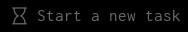
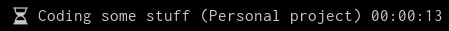

# D-tracker Control

A script to control and display [d-tracker](https://github.com/drmargarido/d-tracker) in [polybar](https://github.com/polybar/polybar).

## Installation

From AUR:

    yay -Sy d-tracker-control-git

or manually:

    git clone https://github.com/ubermanu/polybar-d-tracker-control
    cd polybar-d-tracker-control
    make install

## Requirements

 * [d-tracker](https://github.com/drmargarido/d-tracker)
 * [rofi](https://github.com/davatorium/rofi), for user input

## Preview

When disabled (no currently active task):



When enabled (active task):

 

All the format variables are displayed in the help.

    d-tracker-control --help

## Module

Here is an example:

* Create a new task on left click
* Stops a task on right click
* Open `d-tracker` on middle click

```ini
[module/d-tracker-control]
type = custom/script
tail = true
label-foreground = ${colors.foreground}

exec = d-tracker-control output
interval = 1

click-left = d-tracker-control new
click-right = d-tracker-control stop
click-middle = exec d-tracker &
```
